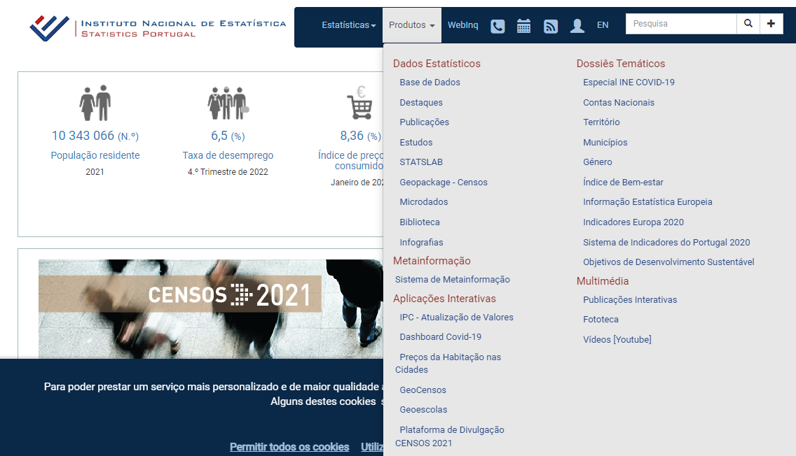
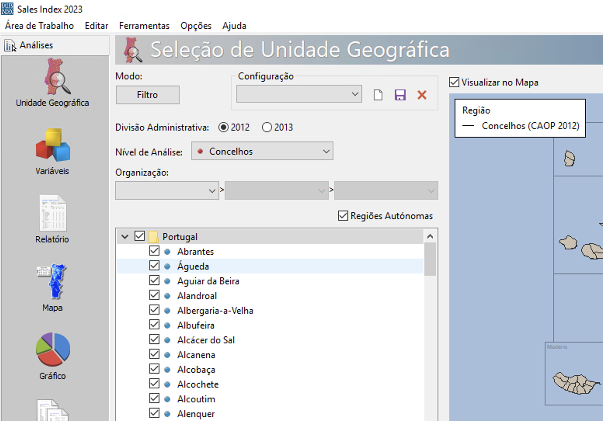

# R training

Use one of the following alternatives to run the code:

## 1. [Posit Cloud](https://login.posit.cloud/)

> Direct link to the project, [https://rstudio.cloud/spaces/100541/project/2953903](https://rstudio.cloud/spaces/100541/project/2953903)

## 2. myBinder project:

> 

> Link: `https://mybinder.org/v2/gh/reisportela/R_Training/HEAD?urlpath=rstudio`

## 3. myBinder repository:

> [https://github.com/reisportela/R_plus_RStudio](https://github.com/reisportela/R_plus_RStudio)

> and clone the contents of the exercise:

### The direct link to RStudio is

RStudio: 

or to the notebook

### Go to:

File > New Project > Version Control > Git

> and paste the following link `https://github.com/reisportela/R_Training.git` in **Repository URL**

## 4. GESIS Notebooks:

> [https://notebooks.gesis.org/](https://notebooks.gesis.org/)

## 5. CodeOcean

> Go to [https://codeocean.com](https://codeocean.com) and create a new capsule from [https://github.com/reisportela/R_Training](https://github.com/reisportela/R_Training)

## 6. WHOLETALE

> Try it at [https://wholetale.org/](https://wholetale.org/)

## 7. GitHub Codespaces

## 8. Install R & RStudio in your machine and download the [project](https://github.com/reisportela/R_Training/archive/refs/heads/master.zip)

## 9. Other

<!--- SEE: https://www.dataschool.io/cloud-services-for-jupyter-notebook -->

> [Google Cloud Platform](https://console.cloud.google.com/)

<!--- [Azure](https://azure.microsoft.com/) -->

> [IBM Cloud Shell](https://cloud.ibm.com/shell)

> [CognitiveLabs (IBM)](https://labs.cognitiveclass.ai/)

> [Colab (Google)](https://colab.research.google.com/)

> [Kaggle Kernels](https://www.kaggle.com/)

> [CoCalc](https://cocalc.com/)

> [Datalore](https://datalore.io/)

> [StarCluster](http://star.mit.edu/cluster/)

> [Galileo](https://hypernetlabs.io/galileo/)

- [Binder Examples](https://github.com/binder-examples)

## 10. Data

### Portugal

- [BPLIM](https://bplim.bportugal.pt/)

- [INE](https://www.ine.pt/)

- [INE: Microdados - protocolo INE/FCT](https://www.dgeec.medu.pt/art/6499db7d9eff36f307f07bdb/65293837121f641a986cc618/65495a4a79026a41502e3e82/64ef206c6358acfd7e9fa9fb)

- [INE: CENSOS](https://censos.ine.pt/xportal/xmain?xpgid=censos21_main&xpid=CENSOS21&xlang=pt)

- [INE: Anuários Estatísticos Regionais](https://www.ine.pt/xportal/xmain?xpid=INE&xpgid=ine_doc_municipios)

- [PORDATA](https://www.pordata.pt/)

- [Data.gov.pt](Data.gov.pt)

- [Portal Autárquico](https://www.portalautarquico.pt/): verificar, por exemplo, a execução orçamental (contas de gerência), disponível desde

- [Fundação José Neves: Bighter Future](https://brighterfuture.joseneves.org/)

- [Orbis](https://orbiseurope.bvdinfo.com/ip)

- Marktest: [Sales Index](https://www.marktest.com/wap/a/grp/p~18.aspx#apresenta%C3%A7%C3%A3o) (sala de computadores da EEG)

### Other

- [Causality with `R`](https://bookdown.org/paul/applied-causal-analysis/)

- [PSID](https://psidonline.isr.umich.edu/)

- [Harvard Dataverse](https://dataverse.harvard.edu/)

- [European Social Survey](http://www.europeansocialsurvey.org/)

- [Angrist Data Archive](https://economics.mit.edu/people/faculty/josh-angrist/angrist-data-archive) -- (see, *e.g.*, [Card](http://economics.mit.edu/faculty/angrist/data1/mhe/card))

- [AMECO](https://ec.europa.eu/info/business-economy-euro/indicators-statistics/economic-databases/macro-economic-database-ameco/ameco-database_en)

- [Comtrade](https://comtrade.un.org/)

- [Eurostat](https://ec.europa.eu/eurostat)

- [OECD](https://stats.oecd.org/)

- [World Bank](https://data.worldbank.org/)

- [FRED](https://fred.stlouisfed.org/)

- [Journal of Applied Econometrics Data Archive](http://qed.econ.queensu.ca/jae/)

- [Banco de Portugal Microdata Research Laboratory (BPLIM) ](https://bplim.bportugal.pt/)

- [Google Public Data](https://www.google.com/publicdata/directory)

- [NBER](https://www.nber.org/research/data)

- [American Economic Association::Journal Data and Program Archives / Replication Studies](https://www.aeaweb.org/rfe/showCat.php?cat_id=9)

- check [Datasets list in EEG's website](https://www.eeg.uminho.pt/en/investigar/recursos/Pages/default.aspx)

# Build your container

- You can write a script to build your container using our definition file template [container_BPLIM_RStudio_researchers.def](https://github.com/BPLIM/Manuals/tree/master/ExternalServer/container_BPLIM_RStudio_researchers.def) available at our [GitHub repository](https://github.com/BPLIM/Manuals/tree/master/ExternalServer)

- In this template we setup a machine running Ubuntu 20.04, R 4.1 and RStudio 1.3.1093

- You can add your packages in line 90 within `c()`; e.g.,

> `c("tidyverse","haven")`

- Test your script and build the container using [SylabsCloud](https://cloud.sylabs.io/) (you can use your GitHub account to login)

- Click in 'CREATE'

- In the following step upload your '.def' file or copy/paste its contents in the Text box:

- Sylabs runs a first test on the validity of your script and releases the button 'Build' (click on it)

- Follow the outcome at the bottom of the screen and check for possible error messages

- Once you succeed in building the container, you can send us the definition file with your changes

### Use the container in BPLIM's server

- Open a `Terminal`

- Move to your project's folder

> `cd /bplimext/projects/YOURPROJECTID/tools/containers`

- Start the container by typing

> `singularity shell YOURPROJECTID.sif`

- The prompt of the `Terminal` will show: `Singularity`

- Start RStudio by typping `rstudio` (small caps)

- Once inside RStudio you have access to the original folder structure of your project

# Reproducibility

- [AER: Use of Docker for Reproducibility in Economics](https://aeadataeditor.github.io/posts/2021-11-16-docker)

- [AER: Creating a Stata project with automated Docker builds](https://github.com/AEADataEditor/stata-project-with-docker)

<!-- https://lamadon.com/computing.html -->

<!--
# Training

## LITERATE PROGRAMMING EM R MARKDOWN | 12 e 14/10/2021 | By: Miguel Portela

Data: 12 e 14 de Outubro | 18h00-21h00

Lecionado por: Miguel Portela, Universidade do Minho

Literate Programming trata-se de fusão de uma narrativa descritiva com um código de computador num único documento, a partir do qual tanto a documentação legível por humanos, quanto os arquivos legíveis por computador, podem ser criados.

O trabalho deve ser transparente, fácil de atualizar, manter e replicar.

Literate Programming permite economizar tempo e esforço, permitindo dedicar mais tempo à pesquisa. Literate Programming também é útil para o ensino.

Programa: 

1. Markdown e Pandoc
2. Crie um documento de Markdown e execute o código
3. Desenvolva um relatório
4. Publique o relatório

Referências:

Xie, Y., Allaire, J.J. and Grolemund, G., 2018. *R markdown: The definitive guide*. CRC Press.

[https://bookdown.org/yihui/rmarkdown/](https://bookdown.org/yihui/rmarkdown/)

-->

# Projeto em Economia Aplicada

## Install R in your computer

### Alternative A:

1. Instal [R](https://cran.r-project.org/bin/windows/base/)
2. Install [RStudio IDE](https://www.rstudio.com/products/rstudio/download/)

### Alternative B:

- Install [Anaconda](https://www.anaconda.com/)

**or** Run R using online services: see the discussion [here](https://github.com/reisportela/R_Training)

## R Training

> **Author**: Nelson Areal/U Minho - [https://nelsonareal.net/](https://nelsonareal.net/)

> February 2022

## SECTION A. Introduction to R

### STEPS:

A.1. Go to Nelson's `Introduction to R' and explore its contents: [https://intro2r.nelsonareal.net/en](https://intro2r.nelsonareal.net/en)

A.2. Create a profile and login to Posit Cloud: [https://login.posit.cloud/](https://login.posit.cloud/)

	- You can use your Gmail or GitHub account

A.3. Run the following two session in Posit Cloud

A.3.1. Session 1: [https://nareal.net/g-intro2r-s1](https://nareal.net/g-intro2r-s1)

A.3.2. Session 2: [http://nareal.net/g-intro2r-s2](http://nareal.net/g-intro2r-s2)

## SECTION B. Data visualisation with R

### Run the following two sessions in Posit Cloud:

B.1. Session 1: [http://nareal.net/g-dv-s1](http://nareal.net/g-dv-s1)

B.2. Session 2: [http://nareal.net/g-dv-s2](http://nareal.net/g-dv-s2)

# Building a Dashboard with R

- See the outcome [here](http://www1.eeg.uminho.pt/economia/mangelo/R_Dashboard.html)

 #### Explore the following links:
 
- [https://rstudio.github.io/flexdashboard/articles/examples.html](https://rstudio.github.io/flexdashboard/articles/examples.html)

- [https://rstudio.github.io/flexdashboard/articles/using.html](https://rstudio.github.io/flexdashboard/articles/using.html)

- [https://pkgs.rstudio.com/flexdashboard/](https://pkgs.rstudio.com/flexdashboard/)

# REFERENCES

1. [R for Data Science](https://r4ds.had.co.nz/)
5. [R Graphics Cookbook](https://r-graphics.org/)
6. [R Markdown: The Definitive Guide](https://bookdown.org/yihui/rmarkdown/)
2. [How to Choose the Right Data Visualization](https://chartio.com/learn/charts/how-to-choose-data-visualization/)
4. [Practical Statistics for Data Scientists](https://www.oreilly.com/library/view/practical-statistics-for/9781491952955/)
9. [A Visual Guide to Stata Graphics](https://www.stata.com/bookstore/visual-guide-to-stata-graphics/)
3. [Causal Inference: The Mixtape](https://mixtape.scunning.com/introduction.html)

# PowerBI web examples

[Brighter Future - FJN](https://joseneves.org/pt/brighter-future)

[APA, Purdue](https://owl.purdue.edu/owl/research_and_citation/apa_style/apa_formatting_and_style_guide/in_text_citations_the_basics.html#:~:text=When%20using%20APA%20format%2C%20follow,the%20end%20of%20the%20paper.)
