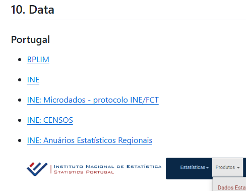
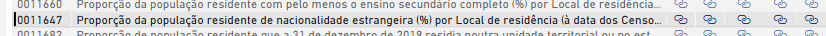
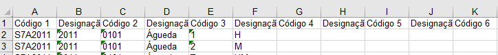

```{r setup,include=FALSE}
knitr::opts_knit$set(root.dir = 'D:\\mportela\\1.aulas\\Dados')

library(dplyr)
library(readxl)
library(stargazer)
# Install necessary packages (if not installed)
# install.packages("rvest")
# install.packages("openxlsx")
library(rvest)
library(openxlsx)
```


## Explorar





## Sales index: laboratório EEG


```{r,include=FALSE}
df <- read_excel("D:/mportela/1.aulas/Dados/Emprego_votantes_V03.xlsx", 
     sheet = "dados")
```

```{r}
str(df)
```


```{r,include=FALSE}
df<- df %>% mutate(desemprego_total_2023 = as.numeric(desemprego_total_2023),tx_desemp=desemprego_total_2023/tco_2021*100,share_chega=eleitores_chega_2024/votantes_2024*100)
```


```{r,include=FALSE}
m1 <- lm(data=df,share_chega ~ tx_desemp,na.action = na.omit)
```

```{r}
summary(m1)
```

## Imigração: Censos, INE


CENSOS 2021 > PRODUTOS > Plataforma de divulgação - Censos 2021 > Aplicação > POPULAÇÃO

Municípios > Pop. estrangeira > Apresentação e Extração de Dados (canto inferior esquerdo)

**Indicador**

Proporção da população residente de nacionalidade estrangeira (%) por Local de residência (à data dos Censos 2021) e Sexo; Decenal



*Escolher o ficheiro XLSX*

> Abrir o ficheiro Excel e criar uma cópia da folha que deverá ser designada, por exemplo, como `dados`. Eliminar as linhas desnecessárias de modo a ficar apenas a informação relevante, designação das colunas e dados




**Carregamento dos dados**


```{r,include=FALSE}
imigracao <- read_excel("D:/mportela/1.aulas/Dados/imigracao.XLSX", 
    sheet = "dados")
```


*Preparação dos dados*

```{r,include=FALSE}
str(imigracao)
table(imigracao$`Designação 3`)

imig<-imigracao %>% filter(`Designação 3`=="HM")  #reter apenas o total
imig<- imig %>% mutate(length=nchar(`Código 2`))
table(imig$length)
imig<-imig %>% filter(length==4) %>% filter(`Designação 1`=="2021") %>% rename(Concelho=`Designação 2`,share_imigrantes=Valor) %>% select(Concelho,share_imigrantes)
```


## Rendimento e desigualdade

https://www.ine.pt/xportal/xmain?xpid=INE&xpgid=ine_doc_municipios_rnl

Produtos > Municípios > Rendimento a nível local (INE STATS lab)

Estatísticas do rendimento ao nível local – Indicadores de rendimento declarado no IRS

Download do ficheiro XLSX com os Quadros

```{r,include=FALSE}
rend <- read_excel("D:/mportela/1.aulas/Dados/ERendimentoNLocal2022.xlsx", 
    sheet = "dados")
str(rend)
rend<-rend %>% filter(`Nível territorial`=="Município") %>% rename(Concelho=Designação) %>% mutate(gini_2022=as.numeric(gini_2022),Rend_medio=as.numeric(Rend_medio))
```


## Crimes: Estatísticas da Justiça

https://estatisticas.justica.gov.pt/sites/siej/pt-pt/Paginas/Crimes_registados_autoridades_policiais.aspx

Escolher Município da Divisão Administrativa (lado direito)

Download do FICHEIRO (canto superior esquerdo)

*Preparar a folha dados com a informação a ser importada pelo R*

```{r,include=FALSE}
crime <- read_excel("D:/mportela/1.aulas/Dados/Municipios_Crimes_registados_pelas_policias__total_e_por_algumas_categorias_de_crime_0.xlsx", 
    sheet = "dados")
str(crime)
crime<-crime %>% filter(unidade=="Município")
```


*Reshape dos dados*: os dados estão no formato wide, pelo que temos de fazer `reshape` para os colocar no formato `long`


```{r,include=FALSE}
library(tidyr)

crime_long <- crime %>%
  pivot_longer(
    cols = starts_with("crimes_"),    # pivot all columns whose names start with "crimes_"
    names_to = "year",                # new column to store the “2021”, “2022”, etc.
    names_prefix = "crimes_",         # remove the “crimes_” part from the new “year” column
    values_to = "crimes"             # new column to store the crime count
  )

crime_long <- crime_long %>% filter(year==2023,unidade=="Município") %>% mutate(crime_num=as.numeric(crimes))
```


## Combinação dos dados


```{r,include=FALSE}
df_full<- df %>% left_join(imig,by="Concelho") %>% left_join(rend,by="Concelho") %>% left_join(crime_long,by="Concelho")
df_full <- df_full %>% mutate(tx_crime=crimes/populacao_2023*1000)
df_full<-as.data.frame(df_full)
```


## Produção de estatísticas

```{r}
stargazer(df_full, type = "text", title = "Summary Statistics", summary.stat = c("mean", "sd", "min", "max"))
```


## Análise de regressão

**Modelo 1**

```{r,include=FALSE}
m2 <- lm(data=df_full,share_chega ~ tx_desemp+share_imigrantes + TX_ESCSUP_2021 +Rend_medio + crimes,na.action=na.omit)
m3 <- lm(data=df_full,BE_PER_2024 ~ tx_desemp+share_imigrantes + TX_ESCSUP_2021 +Rend_medio + crimes,na.action=na.omit)
m4 <- lm(data=df_full,IL_PER_2024 ~ tx_desemp+share_imigrantes + TX_ESCSUP_2021 +Rend_medio + crimes,na.action=na.omit)
m5 <- lm(data=df_full,AD_PER_2024 ~ tx_desemp+share_imigrantes + TX_ESCSUP_2021 +Rend_medio + crimes,na.action=na.omit)
m6 <- lm(data=df_full,PS_PER_2024 ~ tx_desemp+share_imigrantes + TX_ESCSUP_2021 +Rend_medio + crimes,na.action=na.omit)
```


*Apresentação dos resultados*

```{r}
stargazer(m2,m3,m4,m5,m6,type="text")
```


**Modelo 2**

```{r,include=FALSE}
m2 <- lm(data=df_full,CHE_PER_2024 ~ tx_desemp+share_imigrantes + TX_ESCSUP_2021 + crimes,na.action=na.omit)
m3 <- lm(data=df_full,BE_PER_2024 ~ tx_desemp+share_imigrantes + TX_ESCSUP_2021 + crimes,na.action=na.omit)
m4 <- lm(data=df_full,IL_PER_2024 ~ tx_desemp+share_imigrantes + TX_ESCSUP_2021 + crimes,na.action=na.omit)
m5 <- lm(data=df_full,AD_PER_2024 ~ tx_desemp+share_imigrantes + TX_ESCSUP_2021 + crimes,na.action=na.omit)
m6 <- lm(data=df_full,PS_PER_2024 ~ tx_desemp+share_imigrantes + TX_ESCSUP_2021 + crimes,na.action=na.omit)
```


```{r}
stargazer(m2,m3,m4,m5,m6,type="text")
```


## Dados da internet

**Candidatos ao curso de Economia, Minho**


```{r,include=FALSE}
# Define the URL
url <- "https://dges.gov.pt/coloc/2024/col1listaser.asp?CodEstab=1000&CodCurso=9081&ids=1&ide=9999&Mx=9999"

# Read the webpage
webpage <- read_html(url)

# Extract all tables (assuming tables exist)
tables <- html_table(webpage, fill = TRUE)

# Check the extracted tables
length(tables)  # Number of tables found

```


```{r,include=FALSE}
# Select the correct table (adjust index if necessary)
candidatos_economia_minho <- tables[[1]]  # Assuming the first table is the relevant one

# Save as an Excel file
write.xlsx(candidatos_economia_minho, "candidatos_economia_minho.xlsx")

# Print success message
print("Data successfully saved to candidatos_economia_minho.xlsx")

```


## Exemplos de outros dados


> dados.gov

https://dados.gov.pt/

> Portal autárquico

https://portalautarquico.dgal.gov.pt/pt-PT/financas-locais/dados-financeiros/contas-de-gerencia/

> Explorar a navegação em árvore na página do INE

Produtos > Base de Dados > Navegação em Árvore
