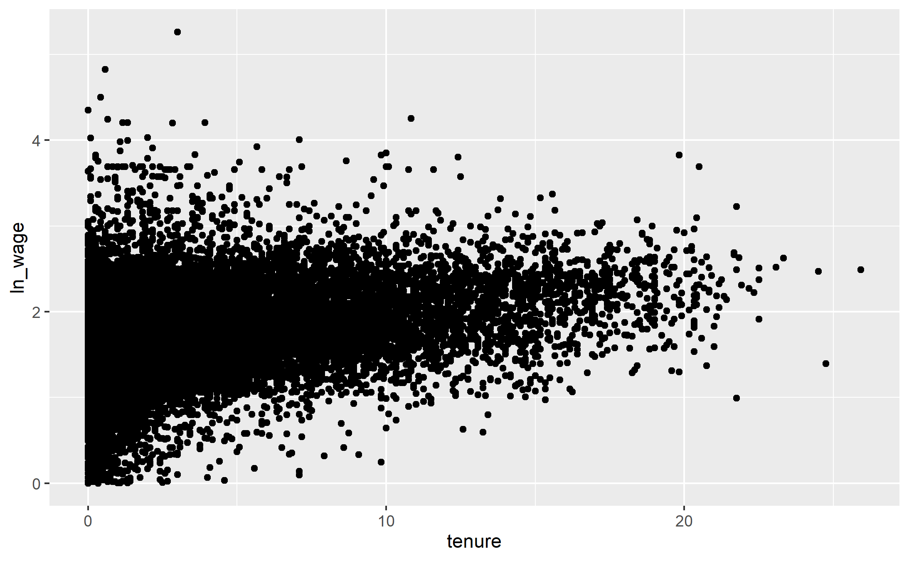

```{r setup, include=FALSE}
library(knitr)
knitr::opts_chunk$set(echo = TRUE)
```


```{r packages, echo=FALSE,results='hide',message=FALSE}
rm(list = ls())

# setwd("/Users/miguelportela/Documents/GitHub/R_Training/examples")
setwd("C:/Users/mangelo.EEG/Documents/GitHub/R_Training/examples")

library(tidyverse)
library(ggplot2)
library(haven)
library(stargazer)
library(rticles)
```

# Introduction

Lorem ipsum dolor sit amet, consectetur adipiscing elit, sed do eiusmod tempor incididunt ut labore et dolore magna aliqua. Auctor eu augue ut lectus arcu bibendum. Aenean vel elit scelerisque mauris pellentesque pulvinar. Massa vitae tortor condimentum lacinia quis vel eros donec ac. Ut placerat orci nulla pellentesque dignissim. Blandit volutpat maecenas volutpat blandit aliquam. Gravida cum sociis natoque penatibus. Quisque id diam vel quam elementum pulvinar etiam. Nulla posuere sollicitudin aliquam ultrices sagittis orci a scelerisque. Netus et malesuada fames ac turpis egestas integer eget. Massa eget egestas purus viverra accumsan. Vulputate dignissim suspendisse in est ante. Vitae sapien pellentesque habitant morbi tristique senectus et. Ac turpis egestas sed tempus urna et. Ipsum a arcu cursus vitae congue mauris rhoncus aenean vel.

```{r data_sets, echo=FALSE,results='hide',message=FALSE}
# data()
attach(mtcars)
nlswork <- read_dta("../data/nlswork.dta")
nls<-data.frame(nlswork)
summary(nlswork)
attach(nlswork)
summary(ln_wage)
```

> You can type in **bold** or _italic_
>
> You can put an __entire sentence in bold__ _or italic_

Lorem ipsum dolor sit amet, consectetur adipiscing elit, sed do eiusmod tempor incididunt ut labore et dolore magna aliqua. Odio eu feugiat pretium nibh. **Quis varius quam quisque id diam vel. Arcu odio ut sem nulla pharetra.** Sem et tortor consequat id porta nibh venenatis cras sed. Eu non diam phasellus vestibulum lorem sed risus. Non quam lacus suspendisse faucibus interdum posuere. Aliquet enim tortor at auctor urna. Amet facilisis magna etiam tempor orci eu lobortis. _Maecenas ultricies mi eget mauris pharetra et. Pharetra et ultrices neque ornare aenean euismod elementum nisi. Aenean vel elit scelerisque mauris pellentesque pulvinar pellentesque._ Fermentum dui faucibus in ornare quam. Auctor elit sed vulputate mi sit.

\pagebreak

If you want to type a `Header` see Section \@ref(literature).

# Literature review{#literature}

Lorem ipsum dolor sit amet, consectetur adipiscing elit, sed do eiusmod tempor incididunt ut labore et dolore magna aliqua. Augue mauris augue neque gravida in fermentum et sollicitudin ac. Placerat orci nulla pellentesque dignissim enim sit amet venenatis. Mollis nunc sed id semper risus in hendrerit. Tortor at risus viverra adipiscing. Blandit cursus risus at ultrices mi tempus. Egestas dui id ornare arcu odio ut sem. Sed sed risus pretium quam vulputate dignissim. Sagittis purus sit amet volutpat. Libero nunc consequat interdum varius sit amet mattis.

> Penatibus et magnis dis parturient montes nascetur ridiculus mus. Cursus eget nunc scelerisque viverra mauris in aliquam. Viverra tellus in hac habitasse. Mattis vulputate enim nulla aliquet. Non pulvinar neque laoreet suspendisse interdum consectetur libero id faucibus. Pharetra massa massa ultricies mi quis hendrerit dolor magna eget. In pellentesque massa placerat duis ultricies lacus. Malesuada fames ac turpis egestas integer eget aliquet nibh. Vitae suscipit tellus mauris a diam.

## Insert a sub-section

### Sub sub-section

# Insert

## Your first _link_

[This is the text you will see](https://www.markdowntutorial.com/)

or [**using bold**](https://www.markdowntutorial.com/)

You can also use reference links to move to [_**my website**_][link1] or to [_Universidade do Minho_][link_uminho]

How to use images and define size
====

## First using a relative size

{width=31%}


or a __fixed size__

{width="1.7in"
height="0.7in"}

You can also use an image from a link:

<!---
{width=25%}
-->

When writing your document you can quote using carat (>). This is called a block quote. The following text was generated using [Lorem Ipsum](https://jaspervdj.be/lorem-markdownum/).

> Tuas vocat velantibus rogos, quem tamen foedere **laetabere bipennifer** nulla
se **camini**. In **forsitan**, in **verti iam** submissaeque faciam adversum et
quae. Tu ille postquam interdum, est sed Britannos, dedecus solae pectore at
modo in adeste vitta tantummodo ingrato. Caedis numina, tonitruque iugum speciem
corpore, leves hunc Zancle auferat umero foribusque cursus negate inhaerentem
Styga Hebre meosque?
>
> Spes speciosoque dixit ferinae agros simulatque domum alimentaque pabula claro;
a costis, a nec captus Aquilone. Pharonque donec, modo suo vires arcanis, quem
illis Vesta quae dedit. Pervenerat placat lenta; sine finxit, tantum pater,
tamen fila sedibus, sonent. Nempe caedit quas fundunt optima sua vultusque
remolliat et habet tendebat Hesperidas: corniger. *Digna* spatium effugere
magne, a pectora hospes volant frena crinis resonant protinus; morte Hippomenen.

Another markdown element you may want to use are **lists**.

# Course Outline

as an _ordered list_

1.	Markdown and Pandoc
2.	Create a markdown document and run code
3.	Develop a report
4.	Publish the report

or just as bullets

* Markdown and Pandoc
* Create a markdown document and run code

where you may need additional depth. Use tabulations

* Markdown and Pandoc
  * Create a markdown document and run code
* Develop a report
  * Publish the report

A more complex example is discussed in Section \@ref(sec:literate:programming).

# LITERATE PROGRAMMING IN R MARKDOWN{#sec:literate:programming}

 - Date: 27 & 29 October | 17h00-20h00
 
 - Delivered by: Miguel Portela, University of Minho 

    Literate programming refers to melding a descriptive narrative and computer code into a single document, from which both human-friendly documentation and computer readable files can be created. Your work should be transparent, easy to update, easy to maintain, and easy to replicate. Literate programming saves time and effort, so we can dedicate more time doing research. Literate programming is also useful for teaching.
 
  **Course Outline**
 
    1.	Markdown and Pandoc
    2.	Create a markdown document and run code
    3.	Develop a report
    4.	Publish the report
 
  **References**

- Xie, Y., Allaire, J.J. and Grolemund, G., 2018. R markdown: The definitive guide. CRC Press. (https://bookdown.org/yihui/rmarkdown/), "_Course 5: Web-based tools for data analysis: JupyterLab environment and workflow optimization_"
    
- The Jupyter Notebook: [https://jupyter-notebook.readthedocs.io/](https://jupyter-notebook.readthedocs.io/)

- [Project Jupyter](https://jupyter.org/)

# Paragraphs & Tables

## Using a double space at the end of the sentence

Phaethon Delphos mea gravis excipiunt stabat: quem aqua taceam Phoebo, vir
aratri, Ulixes haec perque.  
Nactus dempserat sui regnat enim, acta stet Areos
praesagaque in iacent? Fuerant crescentem vinci clamat.[^1]

## Add footnotes

This is a footnote.

## This is a table

Table: Sample table

| Tables   |      Are      |  Cool |
|----------|:-------------:|------:|
| Var 1 is |  Left-Aligned | $1271 |
| Var 2 is |    Centered   |   $13 |
| Var 3 is | Right-Aligned |    $7 |


# The YAML concept

You can add information to your document, like title, author, etc., using [YAML](https://yaml.org/).

> YAML: YAML Ain't Markup Language

> What It Is: YAML is a human friendly data serialization
>  standard for all programming languages.

The following lines are comments so _pandoc_ will not compile them. You can use standard HTML tags to comments out sections of your code.
To see their purpose add them to the beginning of the text.

## Citations

Lorem markdownum medulla: Est hanc instrumenta sibi; premit opem Dianae, *ubi
India* vocesque prodamne, quamvis? Et esse. Quod molire auxiliumque caelumque
tertia hospes, fecerat sermonibus prensamque mortale summa, iubeatis coercet
iugulum, **et**. For a discussion see @MacFarlane ... [further insight is provided in @solow1952structure, pp. 31-32].

# Equations

You can write inline equations as $y_i = \alpha_0 + \tau x_i + \psi_i$ or numbered equations,

\begin{equation}
y_{it} = \beta_0 + \beta_1 x_{it} + \eta_i + \varepsilon_{it}
\end{equation}

# Pandoc's manual

For additional insights see @MacFarlane.

# Build your report

```{r simple_number, echo=FALSE,results='hide'}
summary(ln_wage)
ii <- 4*9
```

The average log wage in our data is `r round(mean(ln_wage,na.rm=TRUE),3)`, while the sum is `r ii`.

```{r descriptive_stats, echo=FALSE, results="asis"}
stargazer(nls,
          title = "Summary table with stargazer",
          label = "table1",
          table.placement = "ht",
          header=FALSE)
```

Table \@ref(table1) shows full data's summary statistics.^[You can also produce statistics for a sub set of variables; see Table \@ref(table:short).] `stargazer()` is and excellent solution to export outputs.

```{r stats_short,echo=FALSE,results='asis'}
nls %>%
  select(tenure,ln_wage) %>%
  stargazer(title = "Short statistics",
          label = "table:short",
          table.placement = "ht",
          header=FALSE)
```

See Figure \@ref(fig:wages-tenure).

```{r wages-tenure, echo=FALSE,fig.cap="Log wages vs. tenure"}
plot(x=tenure,y=ln_wage)
```

An alternative could be to export the figure and include it as an image.

```{r figure-2, fig.cap="Alternative solution",echo =FALSE,results='hide'}
nls2 <- as.data.frame(nlswork)

nls2 %>%
  select(tenure,ln_wage) %>%
  na.omit() %>%
  ggplot(aes(tenure,ln_wage)) + geom_point()

ggsave("images/wages.png")
```

See Figure \@ref(fig:figure-2). We could also include the figure in the following way

{width=65%}

We couls as well include regression analysis. See Table \@ref(regressions) for an example.

```{r regression,echo=FALSE,results='asis'}
M1 <- lm(data = nls2,ln_wage ~ tenure)

# plot(nls2)
# abline(M1)

M2 <- lm(data=nls2,ln_wage ~ tenure + union)

M3 <- lm(data=filter(nls2,year==80),ln_wage ~ tenure + union)


# stargazer(M1,M2,M3,title = "First set of regressions",column.labels = c("M1", "M2","M3"),label = "regressions",table.placement = "ht",notes.append = FALSE,notes.align="l",notes="Standard errors in parentheses.",header = FALSE,no.space = TRUE,covariate.labels = c("TENURE","UNION"),omit = c("Constant"),omit.stat = c("ser"),digits = 2,digits.extra = 4,omit.yes.no = c("Constant",""),type = "text",style = "qje")

# Stargazer manual
# https://cran.r-project.org/web/packages/stargazer/stargazer.pdf

stargazer(M1,M2,M3,title = "Regression analysis", model.numbers = FALSE,column.labels = c("Model 1", "Model 2","Model 3"),label = "regressions",table.placement = "!ht",notes.append = FALSE,notes.align="l",notes="Standard errors in parentheses.",header = FALSE,no.space = TRUE,covariate.labels = c("TENURE","UNION"),omit = c("Constant"),omit.stat = c("adj.rsq","f","ser"),digits = 2,digits.extra = 4,omit.yes.no = c("Constant",""),dep.var.caption="",dep.var.labels.include = FALSE,style = "qje")

betas<-coef(M2)
r2 <- summary(M2)$r.squared
```

The estimated return to tenure is `r round(betas[3]*100,1)`\%. The $R^2$ is `r round(r2,2)`. However, when using only the sample of 1988 the return is `r round(coef(M3)[3],1)`, while the quality of the adjustment `r round(summary(M3)$r.squared,1)`.

We can write the estimated equation

$$\hat{y_i}=`r round(betas[1],1)` + `r round(betas[2],2)`\times tenure_i + `r round(betas[3],2)`\times union_i$$

# Final remarks

Lorem ipsum dolor sit amet, consectetur adipiscing elit, sed do eiusmod tempor incididunt ut labore et dolore magna aliqua. Elit sed vulputate mi sit. Cursus turpis massa tincidunt dui ut ornare lectus sit. Non curabitur gravida arcu ac tortor dignissim convallis aenean. Volutpat consequat mauris nunc congue nisi vitae suscipit. Placerat orci nulla pellentesque dignissim enim sit amet venenatis urna. Accumsan sit amet nulla facilisi morbi tempus iaculis urna. Sagittis aliquam malesuada bibendum arcu vitae elementum curabitur vitae nunc. Blandit cursus risus at ultrices mi tempus imperdiet. Pretium aenean pharetra magna ac placerat vestibulum lectus mauris.

<!---

# BASIC COMPILATION COMMAND

pandoc 1.basic_markdown_example.md -o 1.basic_markdown_example.pdf

# YAML
---
title: Simple markdown exercise
author: Miguel Portela
date: October 2020
bibliography: references.bib
csl: harvard-imperial-college-london.csl
header-includes:
- \usepackage{hyperref}
- \hypersetup{ colorlinks=true, linkcolor=blue, urlcolor=blue, }
---

# COMPILATION WITH CITATIONS

## <<>> Windows
pandoc --citeproc 1.basic_markdown_example.md -o 1.basic_markdown_example.pdf

## <<>> Mac

pandoc --filter pandoc-citeproc 1.basic_markdown_example.md -o 1.basic_markdown_example.pdf

// RStudio Cloud

pip3 install pandoc

export PATH=$PATH:/usr/lib/rstudio-server/bin/pandoc

-->


[link1]:http://www1.eeg.uminho.pt/economia/mangelo/
[link_uminho]:https://www.uminho.pt/EN/


# References {-}


<div id="refs"></div>


# Appendix: Chunk options {-}

The following info is taken from [here](https://r4ds.had.co.nz/r-markdown.html#code-chunks). See the full list at [here](http://yihui.name/knitr/options/).

- `eval` = FALSE prevents code from being evaluated;

- `include` = FALSE runs the code, but doesn’t show the code or results in the final document;

- `echo` = FALSE prevents code, but not the results from appearing in the finished file;

- `message` = FALSE or warning = FALSE prevents messages or warnings from appearing in the finished file;

- `results` = 'hide' hides printed output; fig.show = 'hide' hides plots;

- `error` = TRUE causes the render to continue even if code returns an error.

<!--- -->

[^1]: Ad remorum vestem pater victor Megareus lacrimas adsiduae regina sequenti
Invidiae, ille tum aliquid. Locus uno quid curruque dixit, me regis, deum
**iamque**, et ripas validum ubi! Auras amores quam feritatis apros demite
ademptas est **tanto**!
