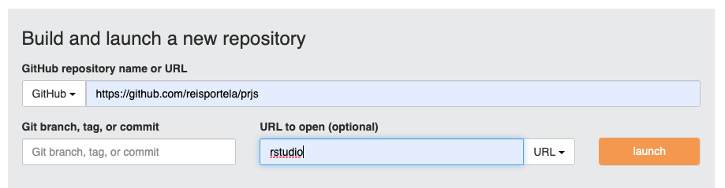

# BPLIM Academy: Jupyter Session
 *M Portela, May 6, 2020*

# 1. Operating System

- Linux (e.g., Ubuntu 20.04), OSX Catalina, Windows 10

# 2. Statistical packages

- Python: install Anaconda -- [https://www.anaconda.com](https://www.anaconda.com/)
- R: [https://www.r-project.org](https://www.r-project.org/)
- Julia: [https://julialang.org](https://julialang.org/)
- Stata: [https://www.stata.com](https://www.stata.com/)

- Recomendation: install [RStudio](https://rstudio.com/products/rstudio/download/)

# 3. [Jupyter](https://jupyter.org/)

## 3.1 Install [jupyter](https://jupyter.org/install)

- **jupyter notebook**: *pip install notebook* or *conda install -c conda-forge notebook*
- **jupyter lab**: *pip install jupyterlab* or *conda install -c conda-forge jupyterlab*

## 3.2 Available [kernels](https://github.com/jupyter/jupyter/wiki/Jupyter-kernels)

- Python: this should be the first one installed [ipykernel](https://pypi.org/project/ipykernel/)

- R: [irkernel](https://irkernel.github.io/installation/)

    Open an R console, e.g. within RStudio, and execute sequentially, *install.packages('IRkernel')*, *IRkernel::installspec()*

- Julia: [IJulia](https://github.com/JuliaLang/IJulia.jl)

    Run Julia and execute sequentially, *using Pkg*, *Pkg.add("IJulia")*

- Stata: [stata_kernel](https://github.com/kylebarron/stata_kernel)

    Detailed installation by [Kyle Barron](https://kylebarron.dev/stata_kernel/getting_started/)

    [Magics](https://kylebarron.dev/stata_kernel/using_stata_kernel/magics/) -- "Magics are programs provided by stata_kernel that enhance the experience of working with Stata in Jupyter."

## 3.3 Start 'notebook' or 'lab'

- **jupyter notebook**: *jupyter notebook*

- **jupyter lab**: *jupyter lab*

# 4. [Binder](https://jupyter.org/binder)

[Running R Projects in MyBinder – Dockerfile Creation With Holepunch](https://www.r-bloggers.com/running-r-projects-in-mybinder-dockerfile-creation-with-holepunch/)

- myBinder
- Gesis Notebooks
- Check the following link on "Configuration Files"

[apt.txt - Install packages with apt-get](https://mybinder.readthedocs.io/en/latest/config_files.html#config-files)

## Examples using the GitHub 'reisportela/prjs'

- Check this example with RStudio & R 3.6 [exercise](https://github.com/reisportela/prjs)

- or a setup where we can build a notebook with Python 3.0 or R (you can also run RStudio from this link)

Even better, use GESIS notebooks to launch your image

[The concept](https://notebooks.gesis.org/user/reisportela@gmail.com)

# 5. A gallery of interesting Jupyter Notebooks

- [Gallery](https://github.com/jupyter/jupyter/wiki/A-gallery-of-interesting-Jupyter-Notebooks)

- [Plotting and Programming in Python](https://swcarpentry.github.io/python-novice-gapminder/)

- [Exploratory data analysis in Python](https://nbviewer.jupyter.org/github/Tanu-N-Prabhu/Python/blob/master/Exploratory_data_Analysis.ipynb)

# 6. Books

- [Python Data Science Handbook](https://jakevdp.github.io/PythonDataScienceHandbook/)

- [Bookdown](https://bookdown.org/)

- [How to Hide all the code cells in Jupyter Notebook Python with single Click](https://www.youtube.com/watch?v=rJsWJMBksK0)

# 7. Checks

- [Binder examples](https://github.com/binder-examples)

- [Binder Multi-language demo](https://github.com/binder-examples/multi-language-demo)

- [mybinder.io](https://mybinder.readthedocs.io/en/latest/index.html)

# 8. SoS [NOTEBOOK](https://vatlab.github.io/sos-docs/)

- [Local installation](https://vatlab.github.io/sos-docs/running.html#Local-installation)

## pip installation

pip3 install sos

pip3 install sos-pbs

pip3 install sos-notebook

pip3 install sos-papermill

pip3 install sos-r

pip3 install sos-julia

pip3 install sos-stata

python3 -m sos_notebook.install

jupyter kernelspec list

jupyter notebook

# 9. Discussion on Julia

- use an environment [julia-python](https://github.com/binder-examples/julia-python)

- a [multi-language-demo](https://blog.jupyter.org/i-python-you-r-we-julia-baf064ca1fb6)

- [Using Julia in Binder: interactive web environment for running your code](https://discourse.julialang.org/t/using-julia-in-binder-interactive-web-environment-for-running-your-code/21802)

By default I will not activate a machine running Python, R and Julia as it takes too long to build the image. I recomend using the [link](http://beta.mybinder.org/v2/gh/binder-examples/julia_python/master).

# 10. [GESIS Notebooks](https://notebooks.gesis.org/)

- Create a login in GESIS Notebooks and add your machine

# 11. Further notes

## 11.1 Jupyter's extensions

*conda install -c conda-forge jupyter_contrib_nbextensions*

*jupyter contrib nbextension install --user*

## 11.2 Kaggle Kernels

[Kaggle](https://towardsdatascience.com/introduction-to-kaggle-kernels-2ad754ebf77)

## 11.3 

[How to Hide all the code cells in Jupyter Notebook Python with single Click](https://www.youtube.com/watch?v=rJsWJMBksK0)

## 11.4 Pandas

[Pandas cookbook](https://mybinder.org/v2/gh/jvns/pandas-cookbook/master)

## R and Dropbox

[rdrop2](https://github.com/karthik/rdrop2)
