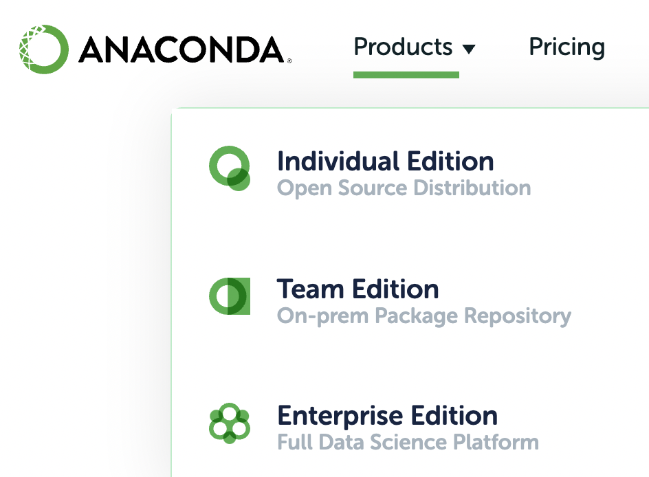
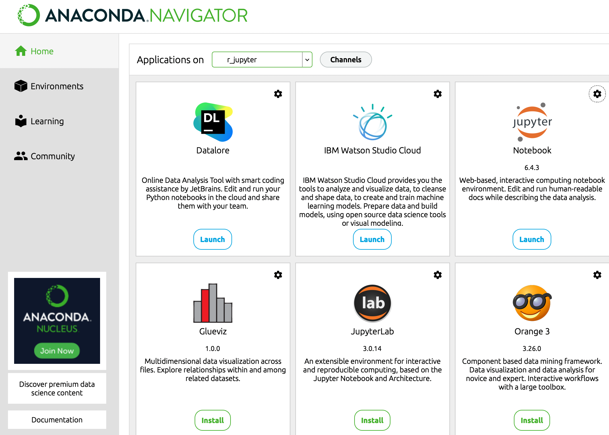
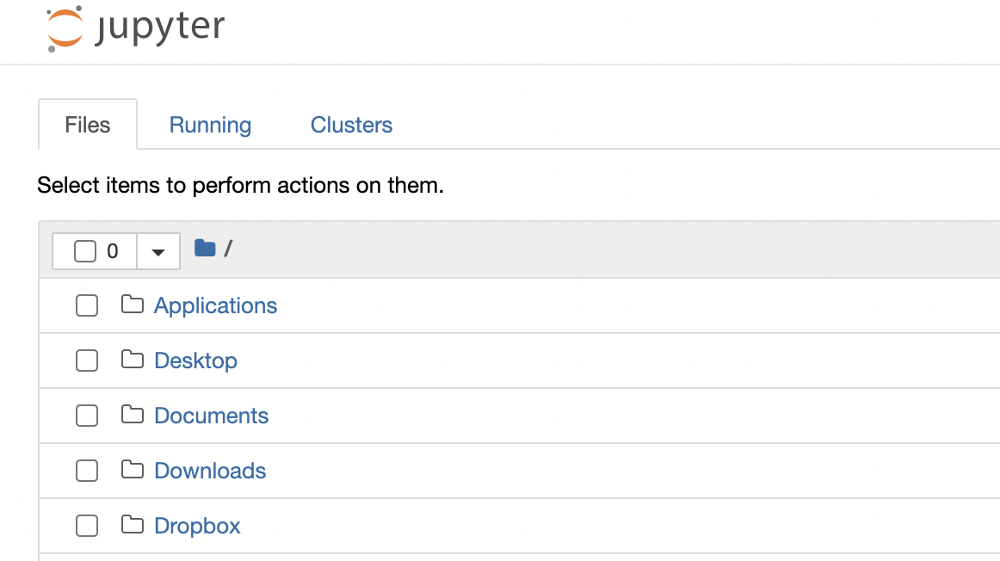
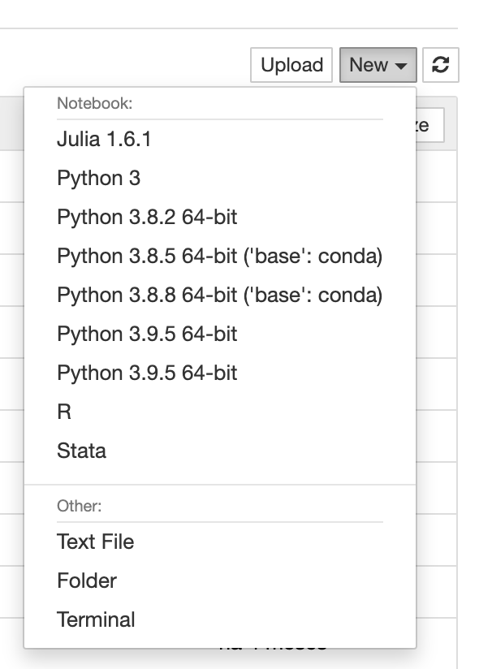

<!--
---
title: "WEB-BASED TOOLS FOR DATA ANALYSIS: JUPYTERLAB ENVIRONMENT AND WORKFLOW OPTIMIZATION"
author: "Miguel Portela"
date: "October 2021"
output:
  pdf_document: default
  html_document: default
header-includes:
- \usepackage{pdfpages}
- \usepackage{graphicx}
mainfont: Times New Roman
sansfont: Times New Roman
fontsize: 12pt
link-citations: true
geometry: "paperwidth=210mm,paperheight=297mm,left=27mm,right=27mm,top=27mm,bottom=27mm"
---
-->

## WEB-BASED TOOLS FOR DATA ANALYSIS: JUPYTERLAB ENVIRONMENT AND WORKFLOW OPTIMIZATION

### Miguel Portela

> October 2021

**The following material is available on GitHub**

[https://github.com/reisportela/R_Training](https://github.com/reisportela/R_Training)

# 1. Operating system: compatible with

- Linux (e.g., Ubuntu 20.04), OSX Catalina, Windows 10

# 2. Install [Jupyter Notebook](https://jupyter.org/) (and JupyterLab)

> "The Jupyter Notebook is an open-source web application that allows you to **create and share** documents that contain _live code_, equations, visualizations and **narrative text**. Uses include: data cleaning and transformation, numerical simulation, statistical modeling, data visualization, machine learning, and much more."

## 2.1 Through Anaconda -- [https://www.anaconda.com](https://www.anaconda.com/)

Go to Anaconda's website and install [Anaconda Individual Edition](https://www.anaconda.com/products/individual)

{width=31%}

Anaconda includes the installation of

- Jupyter Notebook & JupyterLab

- Python

{width=31%}

## 2.2 Setup the different softwares manually

> **Windows**: consider installing [Chocolatey](https://chocolatey.org/), a package manager for Windows (similar to `yum` in CentOS or `brew` in OSX)

> **Example, using Chocolatey**: `choco install anaconda3`
>
> or download and install

- **Python**: [https://www.python.org/](https://www.python.org/)

- **R**: [https://www.r-project.org](https://www.r-project.org/)

- **Julia**: [https://julialang.org](https://julialang.org/)

> Recomendation: install [RStudio](https://rstudio.com/products/rstudio/download/)

### Install [Jupyter](https://jupyter.org/install)

- Open a Terminal in either Linux or OSX

- Open Windows Powershell as Administrator

_*Run the following lines*_

- **jupyter notebook**:

> `pip install notebook`

- **or**

> `conda install -c conda-forge notebook`

- **jupyter lab**:

> `pip install jupyterlab`

- **or**

> `conda install -c conda-forge jupyterlab`

## 2.3 Start a 'notebook' or 'lab'

### 2.3.1 Using Anaconda

> Click in Jupyter Notebook icon

{width=31%}

### 2.3.2 Using a Terminal

Open a `Terminal`/`Power shell`, move to your working folder and type:

- **jupyter notebook**: `jupyter notebook`

- **jupyter lab**: `jupyter lab`

### 2.3.3 It should open your browser with the notebook and the installed kernels.

{width=31%}

## 3. Install your [kernels](https://github.com/jupyter/jupyter/wiki/Jupyter-kernels)

### 3.1 Inside Anaconda

> Make R kernel available for Jupyter

Create a new environment

{width=31%}

following these steps

{width=31%}

Tick the box for R

{width=31%}

and you will see your new environment

{width=31%}

Choose the new environment and start a Jupyter Notebook. R kernel will now be available inside your kernell

### 3.2 Outside Anaconda and for several kernels

1. **Python**: this should be the first one installed [ipykernel](https://pypi.org/project/ipykernel/)

2. **R**: [irkernel](https://irkernel.github.io/installation/)

    Open an R console, e.g. within RStudio, and execute sequentially,
    
    `install.packages('IRkernel')`
    
    `IRkernel::installspec()`
    
    Activate the shortcuts in the OS Terminal. You can also start a Terminal inside the notebook:
    
    
{width=15%}

    Type in the Terminal:
    
    `jupyter labextension install @techrah/text-shortcuts`
    
    
    Install *Jupyter_contrib_nbextensions* following the steps described **[here](https://jupyter-contrib-nbextensions.readthedocs.io/en/latest/install.html)**
    
[Installing jupyter_contrib_nbextensions](https://jupyter-contrib-nbextensions.readthedocs.io/en/latest/install.html)

    `conda install -c conda-forge jupyter_contrib_nbextensions`
    
    `jupyter contrib nbextension install --user`

[jupyter_nbextensions_configurator](https://github.com/Jupyter-contrib/jupyter_nbextensions_configurator)

    `conda install -c conda-forge jupyter_nbextensions_configurator`
    
    `http://localhost:8888/nbextensions?` or `http://localhost:8890/tree#nbextensions_configurator`

[Using Jupyter Notebook extensions](https://docs.anaconda.com/anaconda/user-guide/tasks/use-jupyter-notebook-extensions/?highlight=nbextension#obtaining-the-extensions)

    
--------    
    
    > Add `Node.js` and `npm`
    
    > Visit [Nodejs.org](https://nodejs.org/en/download/) to **install** `Node.js` and `npm`

3. **Julia**: [IJulia](https://github.com/JuliaLang/IJulia.jl)

    Run Julia and execute sequentially, *using Pkg*, *Pkg.add("IJulia")*

4. **Stata**: [stata_kernel](https://github.com/kylebarron/stata_kernel)

>   for Stata see the instructions by [Kyle Barron](https://kylebarron.dev/stata_kernel/getting_started/)
>
>    [Magics](https://kylebarron.dev/stata_kernel/using_stata_kernel/magics/) -- "Magics are programs provided by stata_kernel that enhance the experience of working with Stata in Jupyter."

### You can remove a Kernel:

> `jupyter kernelspec list`
>
> `jupyter kernelspec uninstall unwanted-kernel`

# 4. [Binder](https://jupyter.org/binder)

[Running R Projects in MyBinder: Dockerfile Creation With Holepunch](https://www.r-bloggers.com/running-r-projects-in-mybinder-dockerfile-creation-with-holepunch/)

- myBinder
- Gesis Notebooks

Check the following link

[Configuration Files](https://mybinder.readthedocs.io/en/latest/using/config_files.html)

**mybinder** allows you to create a linked icon to your interactive notebook

> 

> Check the example in GitHub with RStudio & R 3.6 + Python + Julia + Stata 

[`reisportela/prjs`](https://github.com/reisportela/prjs)

- or a setup where we can build a notebook with Python 3.0 or R (you can also run RStudio from this link)

Even better, use [GESIS notebooks](https://notebooks.gesis.org/hub/home) to launch your image

[The concept using GESIS](https://notebooks.gesis.org/user/reisportela@gmail.com)

MyBinder: [EXAMPLES](https://github.com/binder-examples)

# 5. A gallery of interesting Jupyter Notebooks

- [Gallery](https://github.com/jupyter/jupyter/wiki/A-gallery-of-interesting-Jupyter-Notebooks)

- [Plotting and Programming in Python](https://swcarpentry.github.io/python-novice-gapminder/)

- [Exploratory data analysis in Python](https://nbviewer.jupyter.org/github/Tanu-N-Prabhu/Python/blob/master/Exploratory_data_Analysis.ipynb)

# 6. Books

- [Python Data Science Handbook](https://jakevdp.github.io/PythonDataScienceHandbook/)

- [Bookdown](https://bookdown.org/)

- [How to Hide all the code cells in Jupyter Notebook Python with single Click](https://www.youtube.com/watch?v=rJsWJMBksK0)

# 7. Checks

- [Binder Multi-language demo](https://github.com/binder-examples/multi-language-demo)

- [mybinder.io](https://mybinder.readthedocs.io/en/latest/index.html)

# 8. SoS [NOTEBOOK](https://vatlab.github.io/sos-docs/)

- [Local installation](https://vatlab.github.io/sos-docs/running.html#Local-installation)

## pip installation

pip3 install sos

pip3 install sos-pbs

pip3 install sos-notebook

pip3 install sos-papermill

pip3 install sos-r

pip3 install sos-julia

pip3 install sos-stata

python3 -m sos_notebook.install

jupyter kernelspec list

jupyter notebook

# 9. Discussion on Julia

- use an environment [julia-python](https://github.com/binder-examples/julia-python)

- a [multi-language-demo](https://blog.jupyter.org/i-python-you-r-we-julia-baf064ca1fb6)

- [Using Julia in Binder: interactive web environment for running your code](https://discourse.julialang.org/t/using-julia-in-binder-interactive-web-environment-for-running-your-code/21802)

By default I will not activate a machine running Python, R and Julia as it takes too long to build the image. I recomend using the [link](http://beta.mybinder.org/v2/gh/binder-examples/julia_python/master).

# 10. [GESIS Notebooks](https://notebooks.gesis.org/)

- Create a login in GESIS Notebooks and add your machine (running RStudio)

or a **Jupyter Lab**

# 11. Further notes

## 11.1 Jupyter's extensions

*conda install -c conda-forge jupyter_contrib_nbextensions*

*jupyter contrib nbextension install --user*

## 11.2 Kaggle Kernels

[Kaggle](https://towardsdatascience.com/introduction-to-kaggle-kernels-2ad754ebf77)

## 11.3 

[How to Hide all the code cells in Jupyter Notebook Python with single Click](https://www.youtube.com/watch?v=rJsWJMBksK0)

## 11.4 Pandas

[Pandas cookbook](https://mybinder.org/v2/gh/jvns/pandas-cookbook/master)

## R and Dropbox

[rdrop2](https://github.com/karthik/rdrop2)

# 12. Usefull links

> [Binder](https://mybinder.org/)
> 
> [CODE OCEAN](https://codeocean.com/)
> 
> [GESIS Notebooks](https://notebooks.gesis.org/hub/home)
> 
> [Hypernet Labs](https://codeocean.com/)
> 
> [IBM Skills Network Lab](https://labs.cognitiveclass.ai/)
> 
> [RStudio Cloud](https://rstudio.cloud/)

----

# How to prepare a Singularity script

1. Download the script [container_singularity.def](https://github.com/reisportela/R_Training/tree/master/_containers/container_singularity.def)

2. Adapt the file to your project

3. Test the script at [Sylabs](https://cloud.sylabs.io/) and build a Singularity image (e.g., my_RStudio.sif)

4. Test the image

- In your computer in case you have singularity installed

- Use GitHub' CodeSpaces

6. If you are running Linux do as follows:

- Open a TERMINAL and type `singularity shell my_RStudio.sif`

- Once inside Singularity type `rstudio`

- Now you can use your RStudio flavor within your computer and point to your data in `initial_dataset`

# Build a container on your computer using singularity

1. Install `singularity` from [https://sylabs.io/guides/3.0/user-guide/installation.html](https://sylabs.io/guides/3.0/user-guide/installation.html)

2. For Linux to install using package

3. For MacOs or Windows follow the instruction on on to install Vagrant and Vagrant Manager (you need to have Virtual box installed)

4. Difficulty: your computer must be able to run hardware accellarion

5. Specific notes on Vagrant

> Check details [here](https://techtldr.com/how-to-copy-one-file-from-vagrant-virtual-machine-to-local-host/)

- open a Terminal and type `vagrant port`

- you can copy files between your computer (**host**) and Vagrant (**guest**) using the following lines

`scp -P 2200 vagrant@127.0.0.1:/vagrant/some-file.txt`

`scp -P 2222 vagrant@127.0.0.1:/home/vagrant/containers/BPLIM_Dashboard.sif .`

- in Vagrant you have `sudo` permissions

> password:: `vagrant`
> login:: `vagrant`

## Build and use the Vagrant machine

Open a Terminal and move to the folder of your choice

- Initialize a Project Directory: `vagrant init hashicorp/bionic64`

- Install and Specify a Box: `vagrant box add hashicorp/bionic64`

- Bring up a virtual machine: `vagrant up`

- SSH into the machine: `vagrant ssh`

- Build and image inside vagrant: `sudo singularity build BPLIM_Dashboard.sif bplim_Dashboard.def`

or `sudo singularity build BPLIM_Dashboard.sif bplim_Dashboard.def` in case you prefer a `sandbox`

- Test the image: `singularity shell --writable build BPLIM_Dashboard.sif`

- Clean temporary files: `rm -rf /tmp/*`

- Inside vagrant your host folder is mounted here `/vagrant`

- Your `home` folder is located here `/home/vagrant`
