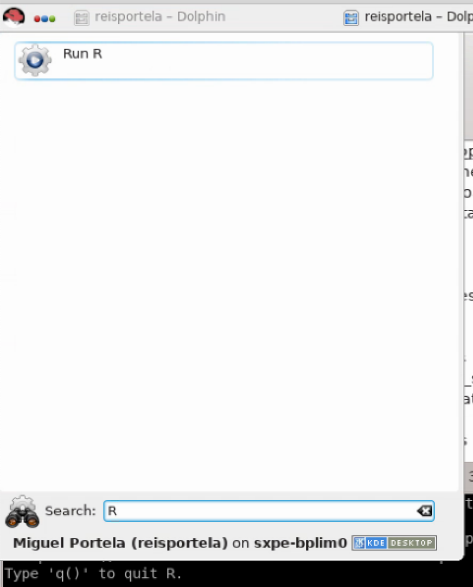

<!---

1. open TERMINAL
2. cd "/Users/miguelportela/Documents/GitHub/R_Training"
3. RUN THE FOLLOWING LINE IN THE TERMINAL

pandoc -V geometry:"paperwidth=210mm,paperheight=297mm,left=27mm,right=27mm,top=27mm,bottom=27mm" markdown_sample.md --pdf-engine=xelatex -o markdown_sample.pdf

ALTERNATIVE

https://marketplace.visualstudio.com/items?itemName=yzane.markdown-pdf

-->

<!--=========================================== --->

Access to the server
===========================================
1. Upon access approval, the User will be able to connect to the external server using one of two possibilities.
  - NoMachine client access (_preferred_)
  - Browser access (_low performance_)

2. Password policy:
  - The first password delivered must be changed at the first login.
  - After 60 days the password will expire: change the password within this time frame (see Appendix 3 for instructions on how to change the password)

3. Upon access using 'NoMachine'

These are the first three screens you will see

{width="4.724409448818897in"
height="1.7223293963254593in"}

This is your working folder structure

+-----------------------------------+-----------------------------------+
| **initial\_dataset**              |                                   |
|                                   | Data sources provided by BPLIM.   |
|                                   |                                   |
|                                   | *You have                         |
|                                   | read-only access to this          |
|                                   | directory.*                       |
+-----------------------------------+-----------------------------------+
| **results**                       |                                   |
|                                   | Output files that                 |
|                                   | researchers wish to generate      |
|                                   | and extract from the server.      |
|                                   |                                   |
|                                   | *You                              |
|                                   | have read-write access to this    |
|                                   | directory.*                       |
+-----------------------------------+-----------------------------------+
| **tools**                         |                                   |
|                                   | Specific analysis tools.          |
|                                   |                                   |
|                                   | *You have read-only access to     |
|                                   | this directory.*                  |
+-----------------------------------+-----------------------------------+
| **work\_area**                    |                                   |
|                                   | Temporary                         |
|                                   | work directory.                   |
|                                   |                                   |
|                                   | *You have read-write              |
|                                   | access to this directory.*        |
+-----------------------------------+-----------------------------------+
| **/bplimext/doc/Manuals**         | Manuals and auxiliary files       |
|                                   | are available here.               |
+-----------------------------------+-----------------------------------+

  - You will have in your **work\_area** folder templates for both Stata and R. By default the template file is read only.

  - By default you also have two files (see image above): (1)
    stata15mp.sh; (2) xstata15mp.sh. Files with the
    \"**sh**\" extension allows you to send commands to
    your operating system or to enter your operating system for
    interactive use. The first one starts Stata version 15 in
    non-graphical mode, while the second launches Stata 15 in
    graphical mode. You can start both applications by typing in the
    Linux shell, for example, 'xstata15mp.sh', or by double-clicking
    the file name in 'Dolphin'.[^2]

  - To reset and disconnect the remote desktop connection or session,
    you can simply log out of your remote session, as shown on the
    screenshot below. After you log out, close the window.[^3]

Confirm before exiting by clicking on the **\"Logout\"** button to close the window[^4]

RedHat \> ApplicationsApplications \> SystemSystem \> Terminal
Terminal

Using Stata
===========

**IMPORTANT**: do not save files in your home directory (/home/USER_LOGIN)

1. Stata can be accessed in interactive graphical or non-graphical
        modes.[^6]

  - Interactive non-graphical mode

    Move to the desired folder, e.g.,

      cd /bplimext/projects/I001\_jdoe/

    and type

      /opt/bplimext/stata15/stata-mp

  - For the interactive graphical mode click on the icons
    "**xstata14mp.sh**" (Stata 14) or
    "**xstata15mp.sh**" (Stata 15) located in the
    'desktop', depending on the desired Stata version,

  - You can use the 'Do-file Editor' in Stata to create your own
      "do-files" and "ado-files", or you can use
      *KWrite* editor (or 'gedit')

  - You can open it from **RedHat** \> **Applications**
      **Applications** \> **Utilities** \> **KWrite**. You can also launch 'KWrite' from the 'shell' by typing 'kwrite'[^5]

  - In case the icon is not in your desktop, use Dolphin, move to folder
    '/opt/bplimext/stata15', and drag and drop the file 'xstata-mp' into
    the desktop[^1]

2. To look for **"ado-files"**:

"Ado-files" are text files containing the Stata program. It is
advisable that one create and save his/her "ado-files" so the results
can be replicated later by running the saved "ado-files" on the
BPLIM's datasets.

Stata looks for "ado-files" in several places. When it comes to
personal ado-directories, they can be categorized in four ways:

  - (SITE), the directory for "ado-files" your site might have
    installed;

  - (PLUS), the directory for "ado-files" you might have
    installed;

  - (PERSONAL), the directory for "ado-files" you might have written;

  - (OLDPLACE), the directory where Stata users used to save their
    personally written ado-files.

The ado-files you have just written or those created for this project
can be found in the current directory (.).

 Specific 'ado-files' you may ask to be made available in the server
 will be placed in your folder
 '/bplimext/projects/YOURPROJECTID/tools'. You should add this folder
 to your Stata 'ado-files' folder by executing the following command
 within Stata,

  sysdir set PERSONAL "/bplimext/projects/YOURPROJECTID/tools"

 You may also edit your 'profile.do' file, located in your root folder,
 "/home/YOURPROJECTID/", and add key instructions you may want to be
 executed every time you start Stata. The above instruction is one of
 such cases. You can create, or edit, the file 'profile.do' using
 'Do-file Editor' within Stata ('vi profile.do' or KWrite are also a
 possibility).

 The ***sysdir*** command within Stata will tell you where they are on
 your computer:

Stata in 'batch' mode
===================================

1.  Start a *\'**shell**\'* in Linux and navigate to the directory
         of the "do-file" file that you want to run (ex: prog1.do)

 **cd /bplim/projects/I001\_jdoe/work\_area/** cd
 /bplimext/projects/I001\_jdoe/work\_area/

2. You might find it easier to use 'Dolphin' (= File Manager) to move
     over your folder structure. In this case, we recommend activating
     the 'shell' (= 'Terminal') associated with 'Dolphin'

  -  use Dolphin/File Manager

  - click 'F4' to activate the shell with Dolphin. Benefit: fast
         transition within folders and, at the same time, the ability
         to run shell commands

3. Create an ASCII file named, e.g., 'batch\_prog1'

4. Inside the file write just a line with the execution command you
     would type in the 'shell'; e.g.,

    /opt/bplimext/stata15/stata-mp do
    /bplimext/projects/BPlim\_inicial/work\_area/prog1.do

7. You may add the extension '.txt' to the name of the batch file, as
     sometimes Stata *doeditor* does not 'see' the file 'batch', while
     it 'sees' 'batch.txt'

8. Once the batch file is created one runs the .do file in batch mode
     by typing in the 'Terminal':

    at now --f batch.txt

9. Type 'man at' to see a further option of the command 'at'; e.g., one
     could type

    at now + 5 hours --f batch.txt

  or

    at now + 4 minutes --f batch\_prog1

  to run the Stata program within 5 hours or 4 minutes from now,
  respectively. 'man' is the help function in Linux

10. Type 'top' in the shell/Terminal to confirm the program is running

11. Under 'top' type 'i' to hide irrelevant processes (show less output)

12. To kill a running process with 'top' press 'k', for 'kill', write
    > the process number and then type '9'. The process number is
    > identified in the first column as PID

13. To get out of the top, type 'q'

14. Useful features of the command 'at':

  - 'atq': use it to see programs in the batch queue (an '=' sign
         indicates the program is running; an 'a' indicates it is in
         the queue and we see the time when it will be executed)

  - 'atrm \#': remove a batch from the batch queue

  - one can see how the batch is running by typing

      'tail --f logcrc\_may21.log'

 It allows you to see an updated version of the last lines of the log;
 *i.e.*, it updates each time the log is changed by Stata. A key
 advantage of tail is that it does not interfere with the log file,
 namely, it does not write over it.

15. Another way to run a program in the background is by using the
     command 'screen'

  - 'screen' is useful when one wants to run Stata in interactive
         mode and still guarantee that if the network connection goes
         down one does not lose the session. We can simply kill the
         'NoMachine' session and recover it later by typing 'screen
         --r'

  - We can run several instances of screen. If this is the case,
         after opening a new NoMachine session we need to type in the
         Terminal shell 'screen --d' to identify the running background
         sessions. We can retrieve a particular session by knowing the
         'pid' number and typing 'screen --r 34176'

Using R
===========

1. As with Stata, R can be accessed in interactive graphical or non-graphical modes.

  - Interactive non-graphical mode: go the RedHat symbol and type `R' in the Search box

{width=50%}
    
  - Alternatively, you can open a Terminal and type R
  - Please make sure R is in your PATH; type \$PATH in the Terminal. If this is not the case, type PATH=\$PATH:/usr/bin/

2. Using RStudio.

  - Open a Terminal and type rstudio
  - Please make sure RStudio is in your PATH; type $PATH in the Terminal. If this is not the case, type PATH=\$PATH:/opt/bplimext/R/usr/lib64/rstudio/bib/

Using julia
===========

1. Open a Terminal and type julia (julia is located in /opt/bplimext/julia/bib/, you can add it to your PATH)

2. Use Atom: open a Terminal and type atom (/opt/bplimext/julia/bib/)

Allowed outputs
=============================

Stata results can be exported to a file on disk using one of the following formats:

1. ASCII files: e.g., log files

2. graphs: as .PNG (do not use the option save, or saving, within a
    graph command; instead, use the separate command line 'graph export
    xyz.png')

3. csv: CSV (Comma Separated Value format), e.g., for use with MS Excel

4. rtf: Rich Text Format for use with word processors

5. xls or xlsx: Excel files with output tables

6. tex: Latex format

User's Home folder
============================

1. Do not save files in your Home folder:
    "/home/USER_ID/".

2. Regularly clean your Trash folder. If your disk use goes over the quota you will be prevented to login. In the Terminal type:
    rm -rf ~/.local/share/Trash/*

Appendix 1 -- Basic 'shell' Commands on Linux
===========================================================

-   **top** List the procedures that are being executed on the
    server

    -   press \'i\' option to omit background processes;

    -   clicar press \' h \' para ***help on top options*** ; \'h\'
        > option to obtain the **top command help**.

-   **pwd** Show current working
    directory

-   **cd** Change directory

    cd /bplimext/projects/I001\_jdoe/work\_area/

    'cd \~' moves to your home folder

<!-- -->

-   **cp** Copy file(s) to a given path

    cp prog1.do /bplimext/projects/I001\_jdoe/results

<!-- -->

-   **mv** Move file(s) or rename a file from a given path

    mv prog1.do /bplimext/projects/I001\_jdoe/results

<!-- -->

-   **rm** Delete a file

    rm /bplimext/projects/I001\_jdoe/results/prog1.do

<!-- -->

-   **mkdir** Creates a directory

    mkdir programas

<!-- -->

-   **rmdir** Deletes a directory

    rmdir programas

<!-- -->

-   **screen** Switch between screen

    screen top

<!-- -->

-   **man** Show the manual page for the given command

    man ls

<!-- -->

-   **du** -h Check the information of disk usage of files and
    directories.

> The "**-h**" option with "**du**" command provides results in "Human
> Readable Format".

Ex: du /bplimext/projects/I001\_jdoe/work\_area/

-   **df** -h Check disk space utilization and show the disk space
    > statistics in "human readable" format.

-   vi View 'ASCII' files; e.g., log files

-   **ghostscript** Preview files with the extensions of **.eps** and
    **.pdf**

> ghostscript /bplimext/projects/I001\_jdoe/results/\`file\_name.pdf\'

-   okular View 'PDF'

-   find Find files

> Structure: find /path option filename
>
> find . --name "\*.do"
>
> Send the 'find' output to a file:
>
> find . --name "\*.do" \> find\_results.txt
>
> Look for a particular string within the 'find' output:
>
> find . --name "\*.do" \| grep "analysis"
>
> Identify files with extension '.do' that **contain** the word 'graph':
>
> find . --name "\*.do" -exec grep "graph export" '{}' \\; -print

-   passwd Change your password

-   **To exit** a program, type **CTRL + C** ('CTRL + C' kills a particular
    execution in the shell)

Appendix 2 -- Using the 'vi' file editor
========================================

1.  In the shell type 'vi batch1.txt'

2.  These are the main shortcut keys

    a.  'i' insert text

    b.  'ESC' key get out of the 'insert' mode

    c.  'x' delete specific characters

    d.  'dd' delete a full line

    e.  '10 dd' delete 10 lines

    f.  'yy' copy lines

    g.  'p' paste lines

    h.  'SHIFT + G' go to the last line

    i.  'gg' goes to the first line

    j.  'ESC + q!' exit 'vi' without writing

    k.  'w!' write and replace the file

    l.  'ESC + q' exit the 'vi' session

    m.  Check, for example,
        <https://www.cs.colostate.edu/helpdocs/vi.html>

3.  Much easier solution: call 'gedit' file editor

4.  Linux commands I have to add to the manual

5.  'CTRL + R': allows me to recover a previous command

6.  vi .bash\_history

<!--- +++++++++++++++++++++++++++++++++++++ -->

[^1]: Dolphin is an intuitive and easy-to-use file manager. You can use it, for example, to browse the directory, to
    create or to delete files/directories (by using the right mouse
    button). For more information about Dolphin, please visit:
    [https://userbase.kde.org/Dolphin](https://translate.google.com/translate?hl=en&prev=_t&sl=pt-BR&tl=en&u=https://userbase.kde.org/Dolphin)
    .

[^2]: In case 'xstata15mp.sh' does not launch Stata please see 'Section
    5.1.b'.

[^3]: Click on the cross button at the upper right corner to close.

[^4]: Note that before exiting the server, you need to make
    sure that all active programs have been closed (unless they have
    been launched in *batch* mode). Running programs in *batch* mode is justified for
    procedures that require high computational resources, intense
    calculation and / or long processing time.

[^5]: The '*shell'* supports the commands in Linux operating system
    (some are disabled).

[^6]: The version of Stata on the server has the same features as the
    Stata on Windows or Mac. By default when the Stata starts in this
    way the \"working directory\" active becomes your folder
    \"work\_area\".

