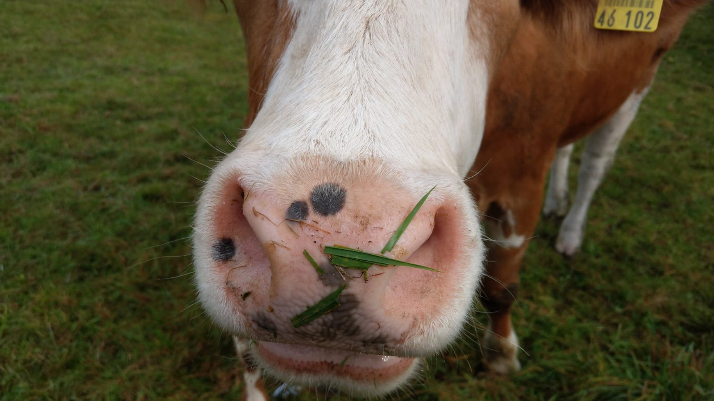

```{r setup, include=FALSE}

# devtools::install_github("Hemken/Statamarkdown")

pacman::p_load(
  bookdown,
  ggplot2,
  knitr,
  devtools,
  tidyverse,
  lubridate,
  modelsummary,
  showtext,
  kableExtra,
  colorspace,
  gridExtra,
  patchwork, 
  xfun,
  palmerpenguins
)


opts_chunk$set(
  cache = FALSE,
  echo = FALSE,
  highlight = TRUE,
  out.width = "90%",
  message = FALSE,
  warning = FALSE,
  comment = NA,
  # figure options
  dpi=300, 
  fig.asp = 0.5, 
  fig.width=12, 
  fig.align="center",
  fig.retina = 5,
  fig.path = "figs/fig", 
  fig.showtext = TRUE
)


## add a font from google fonts
font_add_google(
  name = "Fira Sans",
  family = "Fira Sans"
)

```


```{r global-ggplot-options}

# we use some larger font sizes as we will create high-resolution graphs with the chunk option fig.retina = 5

showtext_auto()
ggplot2::theme_set(theme_minimal() +
  theme(text = element_text(family = "Fira Sans")) +
  theme(
    plot.title = element_text(
      size = 20,
      color = "black",
      hjust = 0.5
    ),
    plot.subtitle = element_text(
      face = "plain",
      size = 16,
      color = "black",
      hjust = 0.5
    ),
    plot.background = element_rect(
      fill = "white",
      color = "white"
    ),
    panel.background = element_blank(),
    panel.grid.major = element_blank(),
    panel.grid.minor = element_blank(),
    panel.border = element_rect(
      colour = "black",
      fill = NA,
      size = 1
    ),
    axis.title = element_text(size = 16),
    axis.text = element_text(size = 16),
    strip.text = element_text(size = 16),
    legend.text = element_text(size = 16),
    legend.title = element_text(size = 16)
  ))

```


```{r load-penguin-data}

penguins = palmerpenguins::penguins

```

\newpage

# The basics

This is a \LaTeX based manuscript that is generated from an Rmd-file by relying on Pandoc for conversion from Markdown to Tex. If you do not specify a `template.tex` in your `YAML` header, Pandoc will use the `default.latex` template, which you can find [here](https://github.com/jgm/pandoc-templates/blob/master/default.latex). I suggest that you start writing reproducible research papers with a solid template that achieves most of your needs for producing a good-looking manuscript, but that you focus on integrating code and content over optimizing the beauty of your document. At the end of the document, you find a code chunk in which you can customize and modify the \LaTeX code that will be written to the `preamble.tex` file that we import in to our reproducible manuscript in the YAML header. I recommend that you make any changes to this preamble there to maintain a single Rmd file that you can re-use for different projects without having to drag too many single files along with the Rmd file in the different directories. 


## Citations

Markdown provides an easy way to cite and reference literature. We add a `bib`-file in our YAML header in the following way:

```{r, echo=TRUE, eval=FALSE}
---
output:
  bookdown::pdf_document2:
csl: 'assets/sage-harvard.csl' 
bibliography: literature.bib  
link-citations: yes 
---
```

We can then cite all entries included in our `.bib`-file by calling `@palmerdata.2020` for inline citations and `[@palmerdata.2020, p.10]` for all other references. Here is an example: the dataset that we use has been created by @palmerdata.2020. If our document specifies a [csl](https://citationstyles.org/) [style](https://www.zotero.org/styles), Pandoc will convert Markdown references, i.e., `@palmerdata.2020`, to 'hardcoded' text and a hyperlink to the reference section in our document. If our document, in contrast, specifies a citation reference package like `biblatex` or `natbib` along with the related options, pandoc will create the corresponding LaTeX commands (e.g. `\autocite`, or `\pcite`) to create the references from our Markdown references.  

## Figures and images

There are several different ways to include images in Rmd documents. For PDF outputs, like `bookdown::pdf_document2`, we can rely on 

1. Plain markdown syntax: `{width=30%}`

{width=30%}

2. \LaTeX syntax

```{r, echo=TRUE, eval=FALSE}
\begin{figure}
\centering
\includegraphics[width=0.3\textwidth]{./figs/snake.jpg}
\caption{A snake}
\end{figure}
```


\begin{figure}
\centering
\includegraphics[width=0.3\textwidth]{./figs/snake.jpg}
\caption{A snake}
\end{figure}


3. Code evaluation and `knitr`

```{r winter, out.width="30%", fig.cap="A winter morning", fig.align="center", echo=TRUE}

knitr::include_graphics(path = "figs/winter.jpg")
```

### Cross-referencing 

Cross-referencing is possible in PDF documents when we rely on `bookdown::pdf_document2`. We can cross-reference sections, figures, tables or equations in our document with the following syntax: `\@ref(fig:winter)`. Here is an example: Figure \@ref(fig:winter) shows a photograph of Munich on a winter morning. If we specify the `colorlinks: true` option in our YAML header, the hyperlinks to the respective figure will be colored. 

Similarly, we can also cross-reference sections, tables or equations. If you do not specify a section label, Pandoc will automatically assign a label based on the title of your header. For more details, see the [Pandoc manual](https://pandoc.org/MANUAL.html#extension-auto_identifiers). If you wish to add a manual label to a header, add `{#mylabel}` to the end of the section header. If you wish to make reference to an equation, you can rely on \LaTeX syntax and put your equations in equation environments and assign a label by `(\#eq:label)`, e.g.,


```{r equation, echo=TRUE, eval=FALSE}
\begin{equation} 
  f\left(k\right) = \binom{n}{k} p^k\left(1-p\right)^{n-k}
  (\#eq:binom)
\end{equation} 
```

# Integrating code and content 


*Literate programming* is key to reproducible documents, which means that we can integrate our code and text into a single document. We can then also include any kind of operations directly in the text by calling R with a single backtick: 
```{r eval=FALSE, echo=TRUE}
`r (2+2)*5`
```
Here is an applied example. Let's calculate the mean bill length of penguins in the data and share this information with the readers, while rounding the number to two digits: `r round(mean(penguins$bill_length_mm, na.rm = T), digits=2)` mm.

\newpage

# Graphs - `ggplot`

```{r ggplot, fig.cap="Body mass and flipper length of penguins."}

mass_flipper <- ggplot(
  data = penguins,
  aes(
    x = flipper_length_mm,
    y = body_mass_g
  )
) +
  geom_point(aes(
    color = species,
    shape = species
  ),
  size = 3,
  alpha = 0.8
  ) +
  labs(
    title = "Penguin size, Palmer Station LTER",
    subtitle = "Flipper length and body mass for Adelie,
       Chinstrap and Gentoo Penguins",
    x = "Flipper length (mm)",
    y = "Body mass (g)",
    color = "Penguin species",
    shape = "Penguin species"
  )


mass_flipper

```  


# Tables 

In \LaTeX documents, Pandoc will automatically load the packages `longtable`, `booktabs`, and `calc` when we specify the option `tables: yes` in our YAML header. 


## Including tables: `kable` 

You can easily create and integrate your tables with the powerful table generating package `kable` and the table styling package `kableExtra`. For the full documentation of the package, see the [vignette](https://haozhu233.github.io/kableExtra/awesome_table_in_pdf.pdf). Here is an example table including some summary statistics of the penguin species. 


```{r kable-advanced}

kable(
  penguins %>%
    group_by(species) %>%
    # calculate mean by species
    summarize(across(
      where(is.numeric),
      ~ mean(., na.rm = T)
    )) %>%
    # drop the year variable for the print out
    select(-year),
  # enable booktabs option (only in PDFs)
  booktabs = T,
  format = "latex",
  # round to two digits
  digits = 2,
  # caption of the table
  caption = "Differences in Flipper and Bill Length across Penguin Species",
  # rename the columns
  col.names = c(
    "Species",
    "Bill Length\n(mm)",
    "Bill Depth\n(mm)",
    "Flipper Length\n(mm)",
    "Body Mass\n(kg)"
  )
) %>%
  # here we include any extra kableExtra options for the styling
  kableExtra::kable_styling(
    latex_options = c(
      "hold",
      "striped",
      # option to fit a wide table
      "scale_down"
    )
  )

```
  

## Including output from regression tables: `modelsummary`

`modelsummary` is a very powerful package to present regression tables in several different output formats. Depending on your preferred table styling package, you can chose among different output formats and then further style the regression table according to your personal needs. In the example below, we use `kableExtra` to style the table. 

```{r regression-table-modelsummary}

url <- 'https://vincentarelbundock.github.io/Rdatasets/csv/Stat2Data/Pulse.csv'
pulse_data <- read_csv(url) %>% 
  select(-X1)


models <- list(
  "M1" = lm(Rest ~ Smoke + Exercise + Wgt + Sex, 
                data = pulse_data),
  "M2" = lm(Rest ~ Smoke*Exercise + Wgt + Sex, 
            data = pulse_data),
  "M3" = lm(Active ~ Smoke + Exercise + Wgt + Sex, 
                data = pulse_data),
  "M4" = lm(Active ~ Smoke*Exercise + Wgt + Sex, 
            data = pulse_data)
)

# report only basic goodness-of-fit statistics
gm = gof_map %>%
  mutate(omit = case_when(
    raw == "r.squared" | raw == "nobs" ~ FALSE,
    TRUE ~ TRUE)
    ) %>% 
  arrange(desc(raw))


reg_table = modelsummary(models,
                         stars = TRUE, 
                         # report only basic goodness-of-fit stats
                         gof_map = gm,
                         output = 'kableExtra')

reg_table %>% 
  # column spanner
  add_header_above(c(" " = 1, 
                     "Resting Pulse" = 2, 
                     "Active Pulse" = 2)) %>%
  # footnote
  add_footnote("Dataset: 'Pulse Rates and Exercise' from the Stat2Data package.",
    notation = "none"
  ) %>%
  row_spec(c(5,11), 
           bold = TRUE)

```


\newpage

# Advanced literate programming

## Literate programming in figure captions

Sometimes, we would like to include the result of a specific evaluated code in the caption of a figure or a table. We can achieve this, by making use of the code chunk option `eval.after`. We might, for instance, include the overall number of penguins that are included in the dataset to our earlier Figure \@ref(fig:ggplot).

```{r lit-prog-caption, eval.after="fig.cap", fig.cap = paste0("Body mass and flipper length of penguins. N = ", nrow(penguins), ".")}

mass_flipper <- ggplot(
  data = penguins,
  aes(
    x = flipper_length_mm,
    y = body_mass_g
  )
) +
  geom_point(aes(
    color = species,
    shape = species
  ),
  size = 3,
  alpha = 0.8
  ) +
  labs(
    title = "Penguin size, Palmer Station LTER",
    subtitle = "Flipper length and body mass for Adelie,
       Chinstrap and Gentoo Penguins",
    x = "Flipper length (mm)",
    y = "Body mass (g)",
    color = "Penguin species",
    shape = "Penguin species"
  )

mass_flipper

```

## Working with other engines in Rmd

### Python with `reticulate` package

The `reticulate` package allows two-way communication between `python` and `R`, thus, you can access any objects created or stored within a `python`-engine chunk from within an `R`-enginge chunk, and *vice versa*. To use the `python`-engine, simply replace the name of the engine after the three backticks and the curyl brace that opens a chunk. 

### STATA with `Statamarkdown` package

You can also use stata as an engine within your workflow. For more details, you can [consult](https://bookdown.org/yihui/rmarkdown-cookbook/eng-stata.html) the RMarkdown cookbook [@Xie.2020, sec. 15.8].

```{stata, eval=FALSE, echo=TRUE}
sysuse auto
summarize
```

# Tweaks in RStudio

There are a number of useful addins in RStudio that facilitate our workflow. You should check out the `remedy` package if you would like to highlight your code, or insert chunks by point-and-click. The `styler` package is a useful addin to tidy your code, which is good practice before sharing your scripts. 

\newpage

# References

```{=latex}
\setlength{\parskip}{10pt}
\setlength{\parindent}{0pt}
\singlespacing
```

::: {#refs}
:::

\newpage

# Online appendix


## Attach R session info in appendix {#sec:rsessioninfo}

Since R and R packages are constantly evolving you might want to add the R session info that contains information on the R version as well as the packages that are loaded. 

```{r echo=FALSE}
xfun::session_info()
```


```{cat write-preamble.tex, engine.opts=list(file = 'preamble.tex')}

%redefine abstract environment
\renewenvironment{abstract}
 {\vfill
  \begin{center}
  \bfseries \abstractname\vspace{-.5em}\vspace{0pt}
  \end{center}
  \list{}{
    \setlength{\leftmargin}{2cm}%
    \setlength{\rightmargin}{\leftmargin}%
  }%
  \item\relax}
 {\endlist}

%redefine the thanks command
\makeatletter
\def\thanks#1{\protected@xdef\@thanks{\@thanks
        \protect\footnotetext{#1}}}
\makeatother


```


```{cat write-doc-prefix.tex, engine.opts=list(file = 'doc-prefix.tex')}

\thispagestyle{empty}
\setcounter{page}{0}

```
